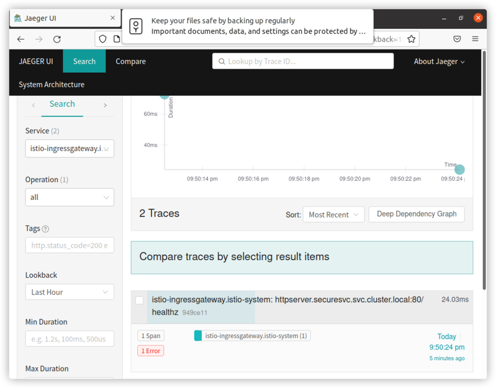

# homework
## deploy httpserver
```shell
kubectl create ns securesvc
kubectl label ns securesvc istio-injection=enabled
kubectl create -f httpserver.yaml -n securesvc
```

## create cert
```shell
openssl req -x509 -sha256 -nodes -days 365 -newkey rsa:2048 -subj '/O=cxn Inc./CN=*.cxn.io' -keyout cxn.key -out cxn.crt
```

## create secret
```shell
kubectl create -n istio-system secret tls cxn-credential --key=cxn.key --cert=cxn.crt
```

## deploy istio-specs
```shell
kubectl apply -f istio-specs.yaml -n securesvc
```

## deploy tracing
```shell
kubectl create -f jaeger.yaml
```

## check ingress ip
```shell
kubectl get svc -nistio-system
NAME                   TYPE           CLUSTER-IP       EXTERNAL-IP   PORT(S)                                                                      AGE
istio-egressgateway    ClusterIP      10.109.121.77    <none>        80/TCP,443/TCP                                                               5d19h
istio-ingressgateway   LoadBalancer   10.105.81.168    <pending>     15021:30957/TCP,80:30465/TCP,443:31139/TCP,31400:32766/TCP,15443:30000/TCP   5d19h
```

## access the httpserver via ingress
```shell
curl --resolve httpsserver.cxn.io:443:10.105.81.168 https://httpsserver.cxn.io/healthz -v -k
```

## visit tracing
```shell
istioctl dashboard jaeger
```
